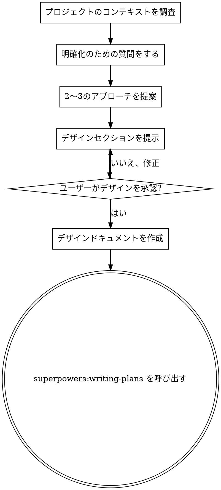

# アイデアをデザインに昇華するブレインストーミング

## 概要

自然な対話を通じて、アイデアを十分に練り上げたデザインと仕様に仕上げるのを支援します。

まず現在のプロジェクトの状況を把握し、次にアイデアを洗練するために一度に1つずつ質問します。何を構築するのか理解したら、デザインを提示してユーザーの承認を得ます。

<HARD-GATE>
デザインを提示してユーザーの承認を得るまでは、いかなる実装スキルの呼び出し、コードの記述、プロジェクトのスキャフォールド、その他の実装作業も行ってはいけません。これは認識される簡易さに関わらず、すべてのプロジェクトに適用されます。
</HARD-GATE>

## アンチパターン: 「これはデザインが不要なほど簡単だ」

すべてのプロジェクトはこのプロセスを経ます。Todoリスト、単一機能のユーティリティ、設定の変更 — すべてです。「簡単な」プロジェクトこそ、検討されていない前提が最も多くの無駄な作業を生みます。本当に簡単なプロジェクトであればデザインは短くて構いません（数文程度）が、必ず提示して承認を得なければなりません。

## チェックリスト

以下の各項目についてタスクを作成し、順番に完了しなければなりません:

1. **プロジェクトのコンテキストを調査** — ファイル、ドキュメント、最近のコミットを確認
2. **明確化のための質問をする** — 一度に1つずつ、目的/制約/成功基準を理解する
3. **2〜3のアプローチを提案** — トレードオフとあなたの推奨を含めて
4. **デザインを提示** — 複雑さに応じたセクションに分けて、各セクション後にユーザーの承認を得る
5. **デザインドキュメントを作成** — `docs/plans/YYYY-MM-DD-<topic>-design.md` に保存してコミット
6. **実装への移行** — superpowers:writing-plans スキルを呼び出して実装計画を作成

## プロセスフロー

**終了状態は superpowers:writing-plans の呼び出しです。** frontend-design、mcp-builder、その他の実装スキルは呼び出さないでください。ブレインストーミングの後に呼び出す唯一のスキルは superpowers:writing-plans です。

## プロセス

**アイデアを理解する:**
- まず現在のプロジェクトの状態を確認する（ファイル、ドキュメント、最近のコミット）
- アイデアを洗練するために一度に1つずつ質問する
- 可能な場合は選択式の質問を優先するが、自由回答でも構わない
- 1メッセージにつき1つの質問のみ — トピックにさらなる深掘りが必要な場合は、複数の質問に分割する
- 理解に集中する: 目的、制約、成功基準

**アプローチを探索する:**
- トレードオフを含む2〜3の異なるアプローチを提案する
- 推奨とその理由を含めて、会話形式でオプションを提示する
- 推奨するオプションを先に示し、その理由を説明する

**デザインを提示する:**
- 何を構築するか理解できたと確信したら、デザインを提示する
- 各セクションの長さは複雑さに応じて調整する: シンプルなら数文、細かいニュアンスがあれば200〜300語程度
- 各セクション後に、ここまでの内容が正しいかどうか確認する
- カバーする内容: アーキテクチャ、コンポーネント、データフロー、エラーハンドリング、テスト
- 何かが理解できない場合は、戻って明確化する準備をする

## デザインの後

**ドキュメント作成:**
- 検証済みのデザインを `docs/plans/YYYY-MM-DD-<topic>-design.md` に書き出す
- 簡潔で明確な文章を心がける
- デザインドキュメントを git にコミットする

**実装:**
- superpowers:writing-plans スキルを呼び出して詳細な実装計画を作成する
- 他のスキルは呼び出さないこと。superpowers:writing-plans が次のステップです。

## 基本原則

- **一度に1つの質問** - 複数の質問で圧倒しない
- **選択式を優先** - 可能な場合、自由回答より答えやすい
- **YAGNI を徹底する** - すべてのデザインから不要な機能を削除する
- **代替案を探索する** - 決定する前に必ず2〜3のアプローチを提案する
- **段階的に検証する** - デザインを提示し、次に進む前に承認を得る
- **柔軟に対応する** - 何かが理解できない場合は戻って明確化する
