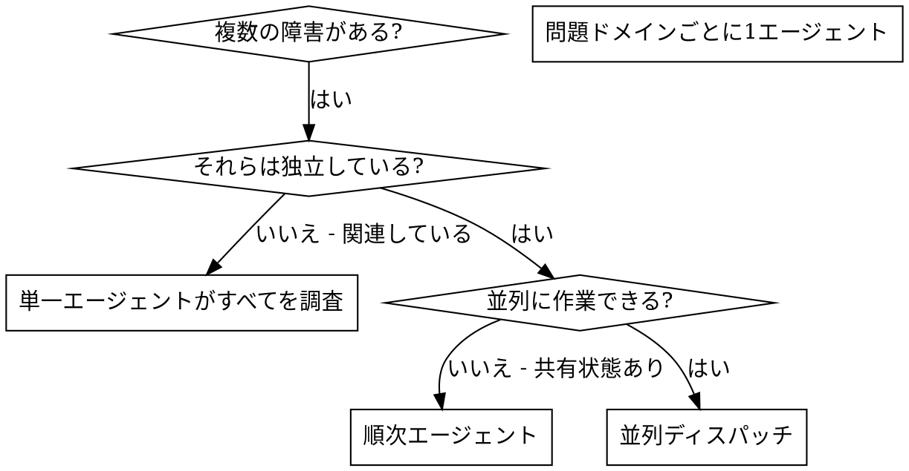

# 並列エージェントのディスパッチ

## 概要

複数の無関係な障害（異なるテストファイル、異なるサブシステム、異なるバグ）がある場合、それらを順番に調査するのは時間の無駄です。各調査は独立しており、並列に実行できます。

**基本原則:** 独立した問題ドメインごとに1つのエージェントをディスパッチする。それらを同時に作業させる。

## 使用するタイミング



**使用する場合:**
- 異なる根本原因で3つ以上のテストファイルが失敗している
- 複数のサブシステムが独立して壊れている
- 各問題が他の問題のコンテキストなしに理解できる
- 調査間で共有状態がない

**使用しない場合:**
- 障害が関連している（1つを修正すると他も修正される可能性がある）
- システム全体の状態を理解する必要がある
- エージェント同士が干渉し合う可能性がある

## パターン

### 1. 独立したドメインを特定する

障害を原因別にグループ化する:
- ファイルAのテスト: ツール承認フロー
- ファイルBのテスト: バッチ完了動作
- ファイルCのテスト: 中断機能

各ドメインは独立しています — ツール承認の修正が中断テストに影響することはありません。

### 2. フォーカスされたエージェントタスクを作成する

各エージェントには以下を与える:
- **具体的なスコープ:** 1つのテストファイルまたはサブシステム
- **明確な目標:** これらのテストを通す
- **制約:** 他のコードを変更しない
- **期待される出力:** 発見した内容と修正した内容のサマリー

### 3. 並列にディスパッチする

```typescript
// Claude Code / AI環境にて
Task("agent-tool-abort.test.ts の失敗を修正")
Task("batch-completion-behavior.test.ts の失敗を修正")
Task("tool-approval-race-conditions.test.ts の失敗を修正")
// 3つすべてが同時に実行される
```

### 4. レビューと統合

エージェントが戻ったら:
- 各サマリーを読む
- 修正が競合しないことを確認する
- フルテストスイートを実行する
- すべての変更を統合する

## エージェントプロンプトの構造

良いエージェントプロンプトとは:
1. **フォーカスされている** - 1つの明確な問題ドメイン
2. **自己完結している** - 問題を理解するために必要なすべてのコンテキストを含む
3. **出力が具体的** - エージェントは何を返すべきか?

```markdown
src/agents/agent-tool-abort.test.ts の失敗している3つのテストを修正してください:

1. "should abort tool with partial output capture" - メッセージに 'interrupted at' が期待される
2. "should handle mixed completed and aborted tools" - 高速ツールが完了ではなく中断された
3. "should properly track pendingToolCount" - 3つの結果が期待されるが0個取得

これらはタイミング/レースコンディションの問題です。あなたのタスク:

1. テストファイルを読んで各テストが何を検証しているか理解する
2. 根本原因を特定する — タイミングの問題か実際のバグか?
3. 以下の方法で修正する:
   - 任意のタイムアウトをイベントベースの待機に置き換える
   - 中断の実装にバグが見つかった場合はそれを修正する
   - 変更された動作をテストしている場合はテストの期待値を調整する

単にタイムアウトを増やすだけではダメです — 本当の問題を見つけてください。

返却: 発見した内容と修正した内容のサマリー。
```

## よくある間違い

**NG スコープが広すぎる:** 「すべてのテストを修正して」 - エージェントが迷子になる
**OK 具体的:** 「agent-tool-abort.test.ts を修正して」 - フォーカスされたスコープ

**NG コンテキストなし:** 「レースコンディションを修正して」 - エージェントがどこかわからない
**OK コンテキストあり:** エラーメッセージとテスト名を貼り付ける

**NG 制約なし:** エージェントがすべてをリファクタリングするかもしれない
**OK 制約あり:** 「本番コードは変更しないでください」または「テストのみ修正」

**NG 出力が曖昧:** 「修正して」 - 何が変わったかわからない
**OK 具体的:** 「根本原因と変更内容のサマリーを返してください」

## 使用しない場合

**関連する障害:** 1つを修正すると他も修正される可能性がある — まず一緒に調査する
**フルコンテキストが必要:** 理解にはシステム全体の把握が必要
**探索的デバッグ:** 何が壊れているかまだわからない
**共有状態:** エージェントが干渉し合う（同じファイルの編集、同じリソースの使用）

## セッションからの実例

**シナリオ:** 大規模リファクタリング後に3つのファイルで6つのテスト失敗

**失敗内容:**
- agent-tool-abort.test.ts: 3件の失敗（タイミングの問題）
- batch-completion-behavior.test.ts: 2件の失敗（ツールが実行されない）
- tool-approval-race-conditions.test.ts: 1件の失敗（実行回数 = 0）

**判断:** 独立したドメイン — 中断ロジックはバッチ完了とは別、レースコンディションとも別

**ディスパッチ:**
```
エージェント1 → agent-tool-abort.test.ts を修正
エージェント2 → batch-completion-behavior.test.ts を修正
エージェント3 → tool-approval-race-conditions.test.ts を修正
```

**結果:**
- エージェント1: タイムアウトをイベントベースの待機に置き換え
- エージェント2: イベント構造のバグを修正（threadId が間違った場所にあった）
- エージェント3: 非同期ツール実行の完了を待つ処理を追加

**統合:** すべての修正が独立しており、競合なし、フルスイートがグリーン

**時間短縮:** 3つの問題が順次ではなく並列で解決

## 主なメリット

1. **並列化** - 複数の調査が同時に行われる
2. **集中** - 各エージェントがスコープを絞り、追跡するコンテキストが少ない
3. **独立性** - エージェント同士が干渉しない
4. **スピード** - 3つの問題が1つの時間で解決

## 検証

エージェントが戻った後:
1. **各サマリーをレビュー** - 何が変わったか理解する
2. **競合を確認** - エージェントが同じコードを編集していないか?
3. **フルスイートを実行** - すべての修正が一緒に動作することを検証する
4. **スポットチェック** - エージェントは系統的なエラーを起こすことがある

## 実際のインパクト

デバッグセッションより:
- 3つのファイルで6件の失敗
- 3つのエージェントを並列にディスパッチ
- すべての調査が同時に完了
- すべての修正が正常に統合
- エージェント間の変更に競合ゼロ
