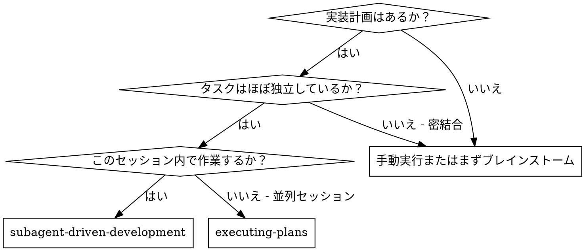
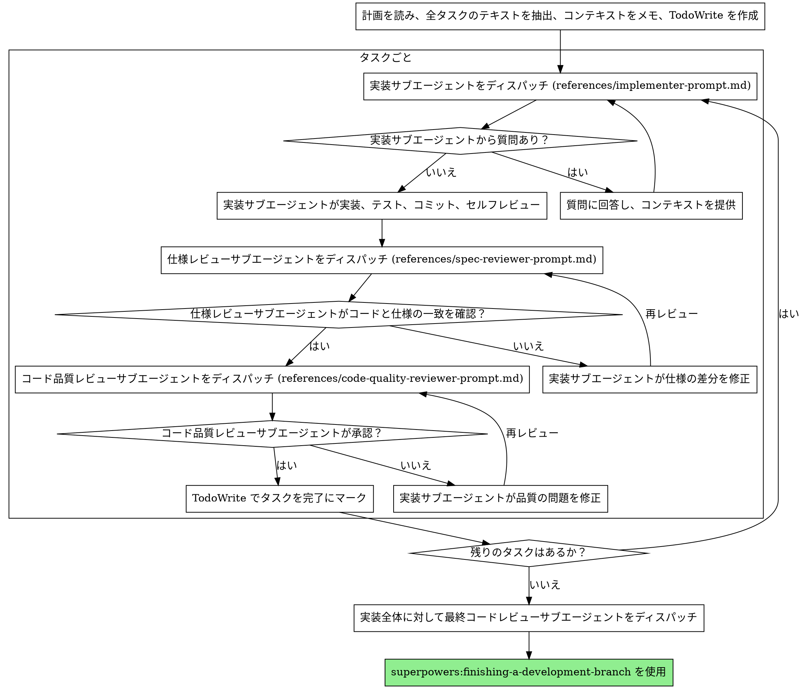

# サブエージェント駆動開発

タスクごとに新しいサブエージェントをディスパッチして計画を実行し、各タスク後に2段階レビューを行う: まず仕様準拠レビュー、次にコード品質レビュー。

**基本原則:** タスクごとに新しいサブエージェント + 2段階レビュー（仕様、次に品質） = 高品質、高速イテレーション

## 使用するタイミング



**計画の実行（並列セッション）との違い:**
- 同一セッション（コンテキストスイッチなし）
- タスクごとに新しいサブエージェント（コンテキスト汚染なし）
- 各タスク後に2段階レビュー: まず仕様準拠、次にコード品質
- 高速イテレーション（タスク間に人間の介入なし）

## プロセス



## プロンプトテンプレート

- `references/implementer-prompt.md` - 実装サブエージェントのディスパッチ
- `references/spec-reviewer-prompt.md` - 仕様準拠レビューサブエージェントのディスパッチ
- `references/code-quality-reviewer-prompt.md` - コード品質レビューサブエージェントのディスパッチ

## ワークフロー例

```
あなた: サブエージェント駆動開発でこの計画を実行します。

[計画ファイルを一度読む: docs/plans/feature-plan.md]
[5つのタスクすべてのテキストとコンテキストを抽出]
[全タスクで TodoWrite を作成]

タスク1: フックインストールスクリプト

[タスク1のテキストとコンテキストを取得（すでに抽出済み）]
[タスクのテキスト全文 + コンテキストで実装サブエージェントをディスパッチ]

実装者: 「始める前に - フックはユーザーレベルとシステムレベルのどちらにインストールすべきですか？」

あなた: 「ユーザーレベル (~/.config/superpowers/hooks/)」

実装者: 「了解しました。実装を開始します...」
[後に] 実装者:
  - install-hook コマンドを実装
  - テスト追加、5/5 パス
  - セルフレビュー: --force フラグの漏れを発見、追加済み
  - コミット済み

[仕様準拠レビュアーをディスパッチ]
仕様レビュアー: 仕様準拠 - 全要件を満たし、余分なものなし

[git SHA を取得、コード品質レビュアーをディスパッチ]
コードレビュアー: 強み: 良好なテストカバレッジ、クリーン。問題点: なし。承認。

[タスク1を完了にマーク]

タスク2: リカバリモード

[タスク2のテキストとコンテキストを取得（すでに抽出済み）]
[タスクのテキスト全文 + コンテキストで実装サブエージェントをディスパッチ]

実装者: [質問なし、作業開始]
実装者:
  - verify/repair モードを追加
  - 8/8 テストパス
  - セルフレビュー: 問題なし
  - コミット済み

[仕様準拠レビュアーをディスパッチ]
仕様レビュアー: 問題あり:
  - 欠落: 進捗レポート（仕様には「100アイテムごとにレポート」と記載）
  - 余分: --json フラグを追加（要求されていない）

[実装者が問題を修正]
実装者: --json フラグを削除、進捗レポートを追加

[仕様レビュアーが再レビュー]
仕様レビュアー: 仕様準拠になった

[コード品質レビュアーをディスパッチ]
コードレビュアー: 強み: 堅実。問題点 (Important): マジックナンバー (100)

[実装者が修正]
実装者: PROGRESS_INTERVAL 定数を抽出

[コードレビュアーが再レビュー]
コードレビュアー: 承認

[タスク2を完了にマーク]

...

[全タスク完了後]
[最終 code-reviewer をディスパッチ]
最終レビュアー: 全要件を満たし、マージ可能

完了!
```

## 利点

**手動実行との比較:**
- サブエージェントが自然に TDD に従う
- タスクごとに新しいコンテキスト（混乱なし）
- 並列安全（サブエージェント同士が干渉しない）
- サブエージェントが質問可能（作業前も作業中も）

**計画の実行との比較:**
- 同一セッション（引き継ぎなし）
- 継続的な進捗（待ち時間なし）
- レビューチェックポイントが自動

**効率性の向上:**
- ファイル読み込みのオーバーヘッドなし（コントローラーがテキスト全文を提供）
- コントローラーが必要なコンテキストを正確にキュレーション
- サブエージェントが完全な情報を事前に取得
- 質問が作業開始前に提起される（完了後ではなく）

**品質ゲート:**
- セルフレビューで引き渡し前に問題をキャッチ
- 2段階レビュー: 仕様準拠、次にコード品質
- レビューループで修正が実際に機能することを確認
- 仕様準拠レビューで過剰/不足な構築を防止
- コード品質レビューで実装の質を確保

**コスト:**
- サブエージェント呼び出しが増加（タスクごとに実装者 + 2レビュアー）
- コントローラーの準備作業が増加（全タスクの事前抽出）
- レビューループでイテレーションが追加
- ただし問題を早期にキャッチ（後からデバッグするより安価）

## 注意すべき問題

**禁止事項:**
- ユーザーの明示的な同意なしに main/master ブランチで実装を開始
- レビューをスキップ（仕様準拠もコード品質も）
- 未修正の問題があるまま進行
- 複数の実装サブエージェントを並列でディスパッチ（コンフリクト）
- サブエージェントに計画ファイルを読ませる（代わりにテキスト全文を提供）
- シーンセッティングのコンテキストをスキップ（サブエージェントはタスクの位置づけを理解する必要がある）
- サブエージェントの質問を無視（作業を進めさせる前に回答）
- 仕様準拠で「大体OK」を許容（仕様レビュアーが問題を発見 = 未完了）
- レビューループをスキップ（レビュアーが問題を発見 = 実装者が修正 = 再レビュー）
- 実装者のセルフレビューを実際のレビューの代替にする（両方必要）
- **仕様準拠が完了する前にコード品質レビューを開始**（順番が逆）
- どちらかのレビューに未解決の問題がある状態で次のタスクに移る

**サブエージェントが質問した場合:**
- 明確かつ完全に回答
- 必要に応じて追加のコンテキストを提供
- 実装を急かさない

**レビュアーが問題を発見した場合:**
- 実装者（同じサブエージェント）が修正
- レビュアーが再レビュー
- 承認されるまで繰り返し
- 再レビューをスキップしない

**サブエージェントがタスクに失敗した場合:**
- 具体的な指示で修正サブエージェントをディスパッチ
- 手動で修正しようとしない（コンテキスト汚染）

## 統合

**必須のワークフロースキル:**
- **superpowers:using-git-worktrees** - 必須: 開始前に隔離されたワークスペースをセットアップ
- **superpowers:writing-plans** - このスキルが実行する計画を作成
- **superpowers:requesting-code-review** - レビュアーサブエージェント用のコードレビューテンプレート
- **superpowers:finishing-a-development-branch** - 全タスク完了後の開発を完了

**サブエージェントが使用すべきもの:**
- **superpowers:test-driven-development** - サブエージェントが各タスクで TDD に従う

**代替ワークフロー:**
- **superpowers:executing-plans** - 同一セッション実行の代わりに並列セッションで使用
