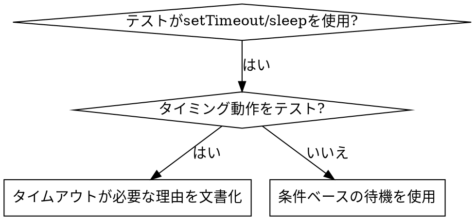

# 条件ベースの待機

## 概要

不安定なテストは、任意の遅延でタイミングを推測することが多い。これにより、高速なマシンではテストが通るが、負荷時やCIでは失敗するレースコンディションが発生する。

**基本原則:** どのくらい時間がかかるかの推測ではなく、実際に関心のある条件を待つこと。

## いつ使うか



**使用する場合:**
- テストに任意の遅延がある（`setTimeout`、`sleep`、`time.sleep()`）
- テストが不安定（たまに通り、負荷時に失敗する）
- 並列実行時にテストがタイムアウトする
- 非同期操作の完了を待つ場合

**使用しない場合:**
- 実際のタイミング動作をテストする場合（デバウンス、スロットルの間隔）
- 任意のタイムアウトを使用する場合は、必ず理由を文書化する

## 基本パターン

```typescript
// NG: タイミングを推測
await new Promise(r => setTimeout(r, 50));
const result = getResult();
expect(result).toBeDefined();

// OK: 条件を待つ
await waitFor(() => getResult() !== undefined);
const result = getResult();
expect(result).toBeDefined();
```

## クイックパターン

| シナリオ | パターン |
|----------|---------|
| イベントを待つ | `waitFor(() => events.find(e => e.type === 'DONE'))` |
| 状態を待つ | `waitFor(() => machine.state === 'ready')` |
| カウントを待つ | `waitFor(() => items.length >= 5)` |
| ファイルを待つ | `waitFor(() => fs.existsSync(path))` |
| 複合条件 | `waitFor(() => obj.ready && obj.value > 10)` |

## 実装

汎用ポーリング関数:
```typescript
async function waitFor<T>(
  condition: () => T | undefined | null | false,
  description: string,
  timeoutMs = 5000
): Promise<T> {
  const startTime = Date.now();

  while (true) {
    const result = condition();
    if (result) return result;

    if (Date.now() - startTime > timeoutMs) {
      throw new Error(`${description}の待機が${timeoutMs}msでタイムアウトしました`);
    }

    await new Promise(r => setTimeout(r, 10)); // 10msごとにポーリング
  }
}
```

実際のデバッグセッションからのドメイン固有ヘルパー（`waitForEvent`、`waitForEventCount`、`waitForEventMatch`）を含む完全な実装については、このディレクトリの `condition-based-waiting-example.ts` を参照。

## よくある間違い

**NG: ポーリングが速すぎる:** `setTimeout(check, 1)` - CPUを浪費
**OK:** 10msごとにポーリング

**NG: タイムアウトなし:** 条件が満たされない場合、永久にループ
**OK:** 明確なエラー付きのタイムアウトを必ず含める

**NG: 古いデータ:** ループ前に状態をキャッシュ
**OK:** 最新データを取得するためにループ内でゲッターを呼ぶ

## 任意のタイムアウトが正しい場合

```typescript
// ツールは100msごとにティックする - 部分的な出力を検証するために2ティック必要
await waitForEvent(manager, 'TOOL_STARTED'); // まず: 条件を待つ
await new Promise(r => setTimeout(r, 200));   // 次に: タイミング動作を待つ
// 200ms = 100ms間隔で2ティック - 文書化され正当化されている
```

**要件:**
1. まずトリガー条件を待つ
2. 既知のタイミングに基づく（推測ではない）
3. 理由を説明するコメント

## 実際の影響

デバッグセッション（2025-10-03）からの実績:
- 3ファイルにわたる15の不安定なテストを修正
- 合格率: 60% → 100%
- 実行時間: 40%高速化
- レースコンディションが解消
