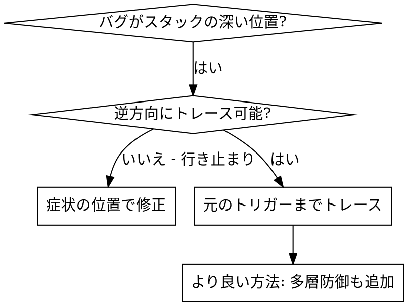
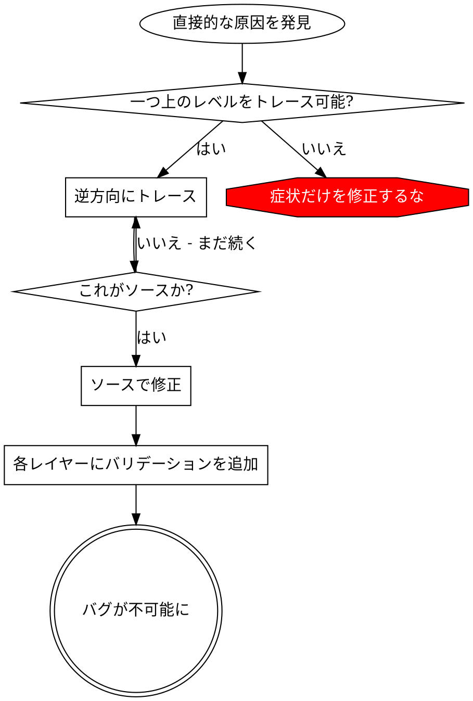

# 根本原因トレーシング

## 概要

バグはコールスタックの深い位置で表面化することが多い（間違ったディレクトリでのgit init、間違った場所に作成されたファイル、間違ったパスで開かれたデータベース）。本能的にはエラーが表示される場所で修正したくなるが、それは症状の治療に過ぎない。

**基本原則:** コールチェーンを逆方向にトレースして元のトリガーを見つけ、ソースで修正する。

## いつ使うか



**使用する場合:**
- エラーが実行の深い位置で発生する（エントリーポイントではない）
- スタックトレースが長いコールチェーンを示す
- 不正なデータの発生源が不明
- どのテスト/コードが問題を引き起こしているか特定が必要

## トレーシングプロセス

### 1. 症状を観察する
```
Error: git init failed in /Users/jesse/project/packages/core
```

### 2. 直接的な原因を見つける
**どのコードが直接これを引き起こしているか？**
```typescript
await execFileAsync('git', ['init'], { cwd: projectDir });
```

### 3. 誰がこれを呼び出したかを問う
```typescript
WorktreeManager.createSessionWorktree(projectDir, sessionId)
  → Session.initializeWorkspace() から呼び出し
  → Session.create() から呼び出し
  → Project.create() のテストから呼び出し
```

### 4. さらに上にトレースする
**どんな値が渡されたか？**
- `projectDir = ''`（空文字列!）
- `cwd` としての空文字列は `process.cwd()` に解決される
- つまりソースコードのディレクトリ!

### 5. 元のトリガーを見つける
**空文字列はどこから来たか？**
```typescript
const context = setupCoreTest(); // { tempDir: '' } を返す
Project.create('name', context.tempDir); // beforeEachの前にアクセス!
```

## スタックトレースの追加

手動でトレースできない場合、計装を追加する:

```typescript
// 問題のある操作の前に
async function gitInit(directory: string) {
  const stack = new Error().stack;
  console.error('DEBUG git init:', {
    directory,
    cwd: process.cwd(),
    nodeEnv: process.env.NODE_ENV,
    stack,
  });

  await execFileAsync('git', ['init'], { cwd: directory });
}
```

**重要:** テストでは `console.error()` を使用する（loggerではない - 表示されない場合がある）

**実行してキャプチャ:**
```bash
npm test 2>&1 | grep 'DEBUG git init'
```

**スタックトレースを分析:**
- テストファイル名を探す
- 呼び出しをトリガーしている行番号を見つける
- パターンを特定する（同じテスト？同じパラメータ？）

## どのテストが汚染を引き起こしているかを見つける

テスト中に何かが出現するが、どのテストかわからない場合:

このディレクトリの二分探索スクリプト `find-polluter.sh` を使用する:

```bash
./find-polluter.sh '.git' 'src/**/*.test.ts'
```

テストを1つずつ実行し、最初の汚染元で停止する。使い方はスクリプトを参照。

## 実例: 空のprojectDir

**症状:** `packages/core/`（ソースコード）に `.git` が作成された

**トレースチェーン:**
1. `git init` が `process.cwd()` で実行 ← cwdパラメータが空
2. WorktreeManager が空のprojectDirで呼び出された
3. Session.create() が空文字列を渡した
4. テストが beforeEach の前に `context.tempDir` にアクセスした
5. setupCoreTest() は初期状態で `{ tempDir: '' }` を返す

**根本原因:** トップレベルの変数初期化が空の値にアクセス

**修正:** beforeEachの前にアクセスするとスローするgetterにtempDirを変更

**多層防御も追加:**
- レイヤー1: `Project.create()` がディレクトリを検証
- レイヤー2: `WorkspaceManager` が空でないことを検証
- レイヤー3: NODE_ENVガードがテスト時にtmpdir外でのgit initを拒否
- レイヤー4: git init前のスタックトレースログ

## 基本原則



**エラーが表示される場所だけを修正してはならない。** 元のトリガーを見つけるために逆方向にトレースせよ。

## スタックトレースのヒント

**テスト内:** `console.error()` を使用する（loggerではない - 抑制される場合がある）
**操作の前に:** 危険な操作の前にログを記録する（失敗した後ではない）
**コンテキストを含める:** ディレクトリ、cwd、環境変数、タイムスタンプ
**スタックをキャプチャ:** `new Error().stack` で完全なコールチェーンが表示される

## 実際の影響

デバッグセッション（2025-10-03）からの実績:
- 5レベルのトレースで根本原因を発見
- ソースで修正（getterバリデーション）
- 4つの防御レイヤーを追加
- 1847件のテストが合格、汚染ゼロ
