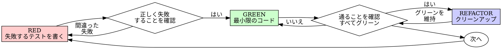

# テスト駆動開発 (TDD)

## 概要

まずテストを書く。失敗を確認する。通るための最小限のコードを書く。

**基本原則:** テストの失敗を確認していなければ、正しいことをテストしているかわからない。

**ルールの文言に違反することは、ルールの精神に違反することである。**

## 使うタイミング

**常に使う:**
- 新機能
- バグ修正
- リファクタリング
- 振る舞いの変更

**例外（あなたの人間パートナーに確認すること）:**
- 使い捨てのプロトタイプ
- 生成されたコード
- 設定ファイル

「今回だけTDDを飛ばそう」と思っている？ 立ち止まれ。それは合理化だ。

## 鉄の掟

```
失敗するテストなしにプロダクションコードを書いてはならない
```

テストより先にコードを書いた？ 削除しろ。最初からやり直せ。

**例外なし:**
- 「参考」として残すな
- テストを書きながら「調整」するな
- それを見るな
- 削除は削除だ

テストから新たに実装せよ。以上。

## Red-Green-Refactor



### RED - 失敗するテストを書く

何が起こるべきかを示す最小限のテストを1つ書く。

<Good>
```typescript
test('失敗した操作を3回リトライする', async () => {
  let attempts = 0;
  const operation = () => {
    attempts++;
    if (attempts < 3) throw new Error('fail');
    return 'success';
  };

  const result = await retryOperation(operation);

  expect(result).toBe('success');
  expect(attempts).toBe(3);
});
```
明確な名前、実際の振る舞いをテスト、1つのことだけ
</Good>

<Bad>
```typescript
test('リトライが動く', async () => {
  const mock = jest.fn()
    .mockRejectedValueOnce(new Error())
    .mockRejectedValueOnce(new Error())
    .mockResolvedValueOnce('success');
  await retryOperation(mock);
  expect(mock).toHaveBeenCalledTimes(3);
});
```
曖昧な名前、コードではなくモックをテストしている
</Bad>

**要件:**
- 1つの振る舞い
- 明確な名前
- 実際のコード（避けられない場合を除きモックは使わない）

### RED の検証 - 失敗を確認する

**必須。絶対に飛ばすな。**

```bash
npm test path/to/test.test.ts
```

確認事項:
- テストが失敗する（エラーではない）
- 失敗メッセージが期待通りである
- 機能が未実装のため失敗する（タイポではない）

**テストが通った？** 既存の振る舞いをテストしている。テストを修正せよ。

**テストがエラーになった？** エラーを修正し、正しく失敗するまで再実行せよ。

### GREEN - 最小限のコード

テストを通すための最もシンプルなコードを書く。

<Good>
```typescript
async function retryOperation<T>(fn: () => Promise<T>): Promise<T> {
  for (let i = 0; i < 3; i++) {
    try {
      return await fn();
    } catch (e) {
      if (i === 2) throw e;
    }
  }
  throw new Error('unreachable');
}
```
通るのに必要な分だけ
</Good>

<Bad>
```typescript
async function retryOperation<T>(
  fn: () => Promise<T>,
  options?: {
    maxRetries?: number;
    backoff?: 'linear' | 'exponential';
    onRetry?: (attempt: number) => void;
  }
): Promise<T> {
  // YAGNI
}
```
過剰設計
</Bad>

テストの範囲を超えて機能を追加したり、他のコードをリファクタリングしたり、「改善」したりしてはならない。

### GREEN の検証 - 通ることを確認する

**必須。**

```bash
npm test path/to/test.test.ts
```

確認事項:
- テストが通る
- 他のテストも通る
- 出力がクリーン（エラー、警告なし）

**テストが失敗した？** コードを修正せよ。テストではない。

**他のテストが失敗した？** 今すぐ修正せよ。

### REFACTOR - クリーンアップ

グリーンになった後のみ:
- 重複を除去
- 名前を改善
- ヘルパーを抽出

テストをグリーンに保つ。振る舞いを追加しない。

### 繰り返し

次の機能のための次の失敗するテストへ。

## 良いテスト

| 品質 | 良い例 | 悪い例 |
|---------|------|-----|
| **最小限** | 1つのこと。名前に「と」がある？分割せよ。 | `test('メール、ドメイン、空白をバリデーションする')` |
| **明確** | 名前が振る舞いを説明する | `test('test1')` |
| **意図を示す** | 望ましいAPIを示す | コードが何をすべきかを曖昧にする |

## 順序が重要な理由

**「動くことを確認するために後でテストを書く」**

後から書いたテストはすぐに通る。すぐに通ることは何も証明しない:
- 間違ったことをテストしているかもしれない
- 振る舞いではなく実装をテストしているかもしれない
- 忘れたエッジケースを見逃しているかもしれない
- テストがバグを検出するのを一度も見ていない

テストファーストはテストの失敗を見ることを強制し、実際に何かをテストしていることを証明する。

**「すべてのエッジケースを手動でテスト済みだ」**

手動テストはその場限りだ。すべてテストしたと思っているが:
- 何をテストしたか記録がない
- コードが変わったときに再実行できない
- プレッシャーの下ではケースを忘れやすい
- 「試したら動いた」≠ 網羅的

自動テストは体系的だ。毎回同じように実行される。

**「X時間の作業を削除するのは無駄だ」**

埋没費用の誤謬だ。時間はすでに失われている。今の選択肢は:
- 削除してTDDで書き直す（さらにX時間、高い信頼性）
- 残して後からテストを追加する（30分、低い信頼性、バグの可能性大）

「無駄」は信頼できないコードを残すことだ。実質的なテストのない動くコードは技術的負債だ。

**「TDDは教条的だ、現実的であることは適応することだ」**

TDDこそが現実的だ:
- コミット前にバグを発見する（後からデバッグするより速い）
- リグレッションを防ぐ（テストが即座に破壊を検出する）
- 振る舞いを文書化する（テストがコードの使い方を示す）
- リファクタリングを可能にする（自由に変更、テストが破壊を検出する）

「現実的な」ショートカット = プロダクションでのデバッグ = より遅い。

**「後からのテストでも同じ目的を達成できる - 形式ではなく精神だ」**

いいえ。後からのテストは「これは何をするか？」に答える。テストファーストは「これは何をすべきか？」に答える。

後からのテストは実装にバイアスされる。要求されたものではなく、構築したものをテストする。発見されたエッジケースではなく、覚えているエッジケースを検証する。

テストファーストは実装前にエッジケースの発見を強制する。後からのテストはすべてを覚えていたかを検証する（覚えていない）。

30分の後付けテスト ≠ TDD。カバレッジは得られるが、テストが機能する証明は失われる。

## よくある合理化

| 言い訳 | 現実 |
|--------|---------|
| 「テストするほど単純ではない」 | シンプルなコードも壊れる。テストは30秒で書ける。 |
| 「後でテストする」 | すぐに通るテストは何も証明しない。 |
| 「後からのテストでも同じ目的を達成できる」 | 後からのテスト =「これは何をするか？」 テストファースト =「これは何をすべきか？」 |
| 「手動でテスト済みだ」 | その場限り ≠ 体系的。記録なし、再実行不可。 |
| 「X時間の削除は無駄だ」 | 埋没費用の誤謬。検証されていないコードを残すことが技術的負債。 |
| 「参考として残し、テストファーストで書く」 | 調整してしまう。それは後付けテストだ。削除は削除。 |
| 「まず探索が必要だ」 | 構わない。探索を捨てて、TDDで始めよ。 |
| 「テストが難しい = 設計が不明確」 | テストに耳を傾けよ。テストしにくい = 使いにくい。 |
| 「TDDは遅くなる」 | TDDはデバッグより速い。現実的 = テストファースト。 |
| 「手動テストの方が速い」 | 手動ではエッジケースを証明できない。変更のたびに再テストが必要。 |
| 「既存コードにテストがない」 | 改善しているのだ。既存コードにテストを追加せよ。 |

## レッドフラグ - 立ち止まって最初からやり直せ

- テストの前にコード
- 実装の後にテスト
- テストがすぐに通る
- テストがなぜ失敗したか説明できない
- テストを「後で」追加
- 「今回だけ」の合理化
- 「手動でテスト済みだ」
- 「後からのテストでも同じ目的を達成できる」
- 「形式ではなく精神だ」
- 「参考として残す」や「既存コードを調整する」
- 「すでにX時間費やした、削除は無駄だ」
- 「TDDは教条的だ、現実的にやっている」
- 「今回は違う、なぜなら...」

**これらすべてが意味すること: コードを削除せよ。TDDでやり直せ。**

## 例: バグ修正

**バグ:** 空のメールが受け入れられる

**RED**
```typescript
test('空のメールを拒否する', async () => {
  const result = await submitForm({ email: '' });
  expect(result.error).toBe('Email required');
});
```

**RED の検証**
```bash
$ npm test
FAIL: expected 'Email required', got undefined
```

**GREEN**
```typescript
function submitForm(data: FormData) {
  if (!data.email?.trim()) {
    return { error: 'Email required' };
  }
  // ...
}
```

**GREEN の検証**
```bash
$ npm test
PASS
```

**REFACTOR**
必要に応じて複数フィールド用のバリデーションを抽出する。

## 検証チェックリスト

作業を完了とマークする前に:

- [ ] すべての新しい関数/メソッドにテストがある
- [ ] 実装前に各テストの失敗を確認した
- [ ] 各テストが期待通りの理由で失敗した（機能未実装であり、タイポではない）
- [ ] 各テストを通すための最小限のコードを書いた
- [ ] すべてのテストが通る
- [ ] 出力がクリーン（エラー、警告なし）
- [ ] テストが実際のコードを使っている（避けられない場合のみモック）
- [ ] エッジケースとエラーがカバーされている

すべてにチェックできない？ TDDを飛ばした。最初からやり直せ。

## 行き詰まったとき

| 問題 | 解決策 |
|---------|----------|
| テスト方法がわからない | 望ましいAPIを書け。まずアサーションを書け。あなたの人間パートナーに聞け。 |
| テストが複雑すぎる | 設計が複雑すぎる。インターフェースを簡素化せよ。 |
| すべてをモックしなければならない | コードの結合度が高すぎる。依存性注入を使え。 |
| テストのセットアップが巨大 | ヘルパーを抽出せよ。それでも複雑？設計を簡素化せよ。 |

## デバッグとの統合

バグを見つけた？ それを再現する失敗するテストを書け。TDDサイクルに従え。テストが修正を証明し、リグレッションを防ぐ。

テストなしにバグを修正するな。

## テストのアンチパターン

モックやテストユーティリティを追加する際は、よくある落とし穴を避けるために @references/testing-anti-patterns.md を参照すること:
- 実際の振る舞いではなくモックの振る舞いをテストする
- プロダクションクラスにテスト専用メソッドを追加する
- 依存関係を理解せずにモックする

## 最後のルール

```
プロダクションコード → テストが存在し、先に失敗していること
それ以外 → TDDではない
```

あなたの人間パートナーの許可なく例外はない。
