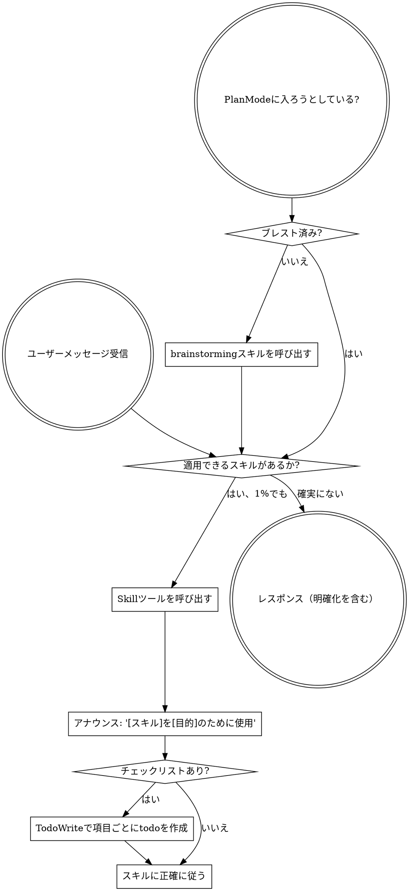

**[必須]**
スキルが適用される可能性が1%でもあると思うなら、絶対にそのスキルを呼び出さなければならない。

スキルがタスクに適用される場合、選択の余地はない。必ず使用しなければならない。

これは交渉不可能だ。これはオプションではない。合理化して逃れることはできない。

## スキルへのアクセス方法

**Claude Codeの場合:** `Skill`ツールを使用する。スキルを呼び出すと、その内容が読み込まれて提示される - それに直接従うこと。スキルファイルに対してReadツールを使ってはならない。

**他の環境の場合:** スキルの読み込み方法についてはプラットフォームのドキュメントを確認すること。

# スキルの使い方

## ルール

**関連するまたはリクエストされたスキルは、あらゆるレスポンスやアクションの前に呼び出す。** スキルが適用される可能性が1%でもあれば、スキルを呼び出して確認すべきだ。呼び出したスキルがその状況に合わなかった場合、使う必要はない。

## レッドフラグ

以下の思考は「やめろ」のサイン - 合理化している:

| 思考 | 現実 |
|---------|---------|
| 「これは単純な質問だ」 | 質問もタスクだ。スキルを確認せよ。 |
| 「まずコンテキストが必要だ」 | スキルの確認は明確化の質問より先。 |
| 「まずコードベースを探索しよう」 | スキルが探索の方法を教えてくれる。先に確認せよ。 |
| 「git/ファイルをすぐに確認できる」 | ファイルには会話のコンテキストがない。スキルを確認せよ。 |
| 「まず情報を集めよう」 | スキルが情報の集め方を教えてくれる。 |
| 「これには正式なスキルは不要だ」 | スキルが存在するなら使え。 |
| 「このスキルを覚えている」 | スキルは進化する。現在のバージョンを読め。 |
| 「これはタスクとは言えない」 | アクション = タスク。スキルを確認せよ。 |
| 「スキルは大げさすぎる」 | シンプルなことも複雑になる。使え。 |
| 「まずこれだけやろう」 | 何かをする前に確認せよ。 |
| 「これは生産的だ」 | 規律のないアクションは時間の無駄。スキルがこれを防ぐ。 |
| 「それが何か知っている」 | 概念を知っている ≠ スキルを使う。呼び出せ。 |

## スキルの優先順位

複数のスキルが適用できる場合、この順序で使う:

1. **プロセススキルが先**（brainstorming、debugging） - タスクへのアプローチ方法を決定する
2. **実装スキルが後**（frontend-design、mcp-builder） - 実行をガイドする

「Xを作ろう」→ まずbrainstorming、次に実装スキル。
「このバグを直して」→ まずdebugging、次にドメイン固有のスキル。

## スキルの種類

**厳格**（TDD、debugging）: 正確に従う。規律から離れてはならない。

**柔軟**（パターン）: 原則をコンテキストに適応させる。

スキル自体がどちらかを示す。

## ユーザーの指示

指示は「何を」であり、「どのように」ではない。「Xを追加して」や「Yを修正して」はワークフローをスキップすることを意味しない。
