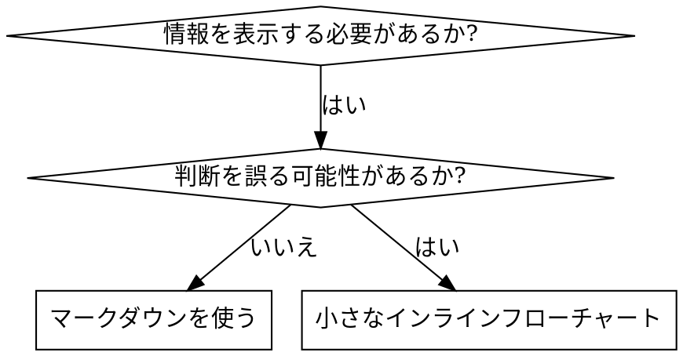

# スキルの作成

## 概要

**スキルの作成とは、プロセスドキュメントにテスト駆動開発を適用することである。**

**個人用スキルはエージェント固有のディレクトリに配置する（Claude Codeは`~/.claude/skills`、Codexは`~/.agents/skills/`）**

テストケース（サブエージェントを使ったプレッシャーシナリオ）を書き、失敗を確認し（ベースライン動作）、スキル（ドキュメント）を書き、テスト通過を確認し（エージェントが準拠）、リファクタリング（抜け穴を塞ぐ）を行う。

**基本原則:** スキルなしでエージェントが失敗するのを見ていなければ、そのスキルが正しいことを教えているかどうかわからない。

**必須の前提知識:** このスキルを使う前に、superpowers:test-driven-developmentを理解していなければならない。そのスキルは基本的なRED-GREEN-REFACTORサイクルを定義している。このスキルはTDDをドキュメントに適用するものである。

**公式ガイダンス:** Anthropicの公式スキル作成ベストプラクティスについては、references/anthropic-best-practices.mdを参照。このドキュメントは、本スキルのTDD重視のアプローチを補完する追加パターンとガイドラインを提供する。

## スキルとは何か?

**スキル**とは、実績のある技法、パターン、またはツールのリファレンスガイドである。スキルは将来のClaudeインスタンスが効果的なアプローチを見つけて適用するのに役立つ。

**スキルとは:** 再利用可能な技法、パターン、ツール、リファレンスガイド

**スキルではないもの:** ある問題を一度どう解決したかのナラティブ

## スキルのためのTDDマッピング

| TDDの概念 | スキル作成 |
|-----------|-----------|
| **テストケース** | サブエージェントを使ったプレッシャーシナリオ |
| **プロダクションコード** | スキルドキュメント (SKILL.md) |
| **テスト失敗 (RED)** | スキルなしでエージェントがルールに違反（ベースライン） |
| **テスト通過 (GREEN)** | スキルありでエージェントが準拠 |
| **リファクタリング** | コンプライアンスを維持しつつ抜け穴を塞ぐ |
| **テストを先に書く** | スキルを書く前にベースラインシナリオを実行する |
| **失敗を確認する** | エージェントが使う合理化を正確に記録する |
| **最小限のコード** | 特定の違反に対処するスキルを書く |
| **通過を確認する** | エージェントが準拠することを検証する |
| **リファクタリングサイクル** | 新しい合理化を発見 → 塞ぐ → 再検証 |

スキル作成プロセス全体がRED-GREEN-REFACTORに従う。

## スキルを作成すべきとき

**作成すべき場合:**
- 技法が直感的に明白でなかった場合
- プロジェクトを超えて再度参照する場合
- パターンが広く適用可能（プロジェクト固有でない）な場合
- 他の人にも有益な場合

**作成すべきでない場合:**
- 一度きりの解決策
- 他で十分にドキュメント化されている標準的なプラクティス
- プロジェクト固有の規約（CLAUDE.mdに記載する）
- 機械的な制約（正規表現やバリデーションで強制できるなら自動化する - ドキュメントは判断が必要な場合に使う）

## スキルの種類

### テクニック
具体的な手順を持つ方法（condition-based-waiting、root-cause-tracing）

### パターン
問題の考え方（flatten-with-flags、test-invariants）

### リファレンス
APIドキュメント、構文ガイド、ツールドキュメント（officeドキュメントなど）

## ディレクトリ構造


```
skills/
  skill-name/
    SKILL.md              # メインリファレンス（必須）
    supporting-file.*     # 必要な場合のみ
```

**フラットな名前空間** - すべてのスキルを一つの検索可能な名前空間に配置

**別ファイルにする場合:**
1. **大量のリファレンス**（100行以上） - APIドキュメント、包括的な構文
2. **再利用可能なツール** - スクリプト、ユーティリティ、テンプレート

**インラインに保持:**
- 原則と概念
- コードパターン（50行未満）
- その他すべて

## SKILL.mdの構造

**フロントマター (YAML):**
- サポートされるフィールドは`name`と`description`の2つのみ
- 合計最大1024文字
- `name`: 英字、数字、ハイフンのみ使用（括弧や特殊文字は不可）
- `description`: 三人称で、いつ使うかのみを記述（何をするかではない）
  - 「Use when...」で始めてトリガー条件に焦点を当てる
  - 具体的な症状、状況、コンテキストを含める
  - **スキルのプロセスやワークフローを要約してはならない**（CSOセクションで理由を説明）
  - 可能であれば500文字以内に収める

```markdown
---
name: Skill-Name-With-Hyphens
description: Use when [具体的なトリガー条件と症状]
---

# スキル名

## 概要
これは何か? 基本原則を1-2文で。

## いつ使うか
[判断が非自明な場合は小さなインラインフローチャート]

症状とユースケースの箇条書き
いつ使わないか

## コアパターン（テクニック/パターン向け）
変更前/後のコード比較

## クイックリファレンス
よくある操作をスキャンするためのテーブルまたは箇条書き

## 実装
シンプルなパターンはインラインコード
大量のリファレンスや再利用可能なツールはファイルへのリンク

## よくある間違い
何がうまくいかないか + 修正方法

## 実世界での効果（オプション）
具体的な結果
```


## Claude検索最適化 (CSO)

**発見のために重要:** 将来のClaudeがスキルを見つけられる必要がある

### 1. 充実したdescriptionフィールド

**目的:** Claudeはdescriptionを読んで、与えられたタスクにどのスキルをロードするか決定する。「今このスキルを読むべきか?」に答えられるようにする。

**形式:** 「Use when...」で始めてトリガー条件に焦点を当てる

**重要: description = いつ使うか であって、スキルが何をするか ではない**

descriptionにはトリガー条件のみを記述すべきである。スキルのプロセスやワークフローをdescriptionに要約してはならない。

**なぜ重要か:** テストの結果、descriptionがスキルのワークフローを要約していると、Claudeがスキル本文を読まずにdescriptionに従ってしまうことが判明した。「タスク間でコードレビュー」というdescriptionがあると、スキルのフローチャートが明確に2回のレビューを示していたにもかかわらず、Claudeは1回のレビューしか行わなかった。

descriptionを「独立したタスクを持つ実装計画を実行する際に使用する」（ワークフロー要約なし）に変更したところ、Claudeはフローチャートを正しく読み、2段階のレビュープロセスに従った。

**罠:** ワークフローを要約するdescriptionはClaudeが利用するショートカットを作り出す。スキル本文はClaudeが読み飛ばすドキュメントになってしまう。

```yaml
# 誤: ワークフローを要約 - Claudeがスキルを読まずにこれに従う可能性
description: Use when executing plans - dispatches subagent per task with code review between tasks

# 誤: プロセスの詳細が多すぎる
description: Use for TDD - write test first, watch it fail, write minimal code, refactor

# 正: トリガー条件のみ、ワークフロー要約なし
description: Use when executing implementation plans with independent tasks in the current session

# 正: トリガー条件のみ
description: Use when implementing any feature or bugfix, before writing implementation code
```

**内容:**
- スキルが適用されることを示す具体的なトリガー、症状、状況を使う
- *問題*（競合状態、不整合な動作）を記述し、*言語固有の症状*（setTimeout、sleep）は記述しない
- スキル自体が技術固有でない限り、トリガーはテクノロジーに依存しないものにする
- スキルが技術固有の場合は、トリガーでそれを明示する
- 三人称で書く（システムプロンプトに注入される）
- **スキルのプロセスやワークフローを要約しない**

```yaml
# 誤: 抽象的すぎる、曖昧、いつ使うかが含まれていない
description: For async testing

# 誤: 一人称
description: I can help you with async tests when they're flaky

# 誤: テクノロジーに言及しているがスキルはそれに固有ではない
description: Use when tests use setTimeout/sleep and are flaky

# 正: 「Use when」で始まり、問題を記述、ワークフローなし
description: Use when tests have race conditions, timing dependencies, or pass/fail inconsistently

# 正: 明示的なトリガーを持つ技術固有のスキル
description: Use when using React Router and handling authentication redirects
```

### 2. キーワードカバレッジ

Claudeが検索するであろう単語を使う:
- エラーメッセージ: "Hook timed out", "ENOTEMPTY", "race condition"
- 症状: "flaky", "hanging", "zombie", "pollution"
- 同義語: "timeout/hang/freeze", "cleanup/teardown/afterEach"
- ツール: 実際のコマンド、ライブラリ名、ファイルタイプ

### 3. 説明的な命名

**能動態、動詞先頭を使う:**
- 正 `creating-skills` 誤 `skill-creation`
- 正 `condition-based-waiting` 誤 `async-test-helpers`

### 4. トークン効率（重要）

**問題:** getting-startedや頻繁に参照されるスキルはすべての会話にロードされる。すべてのトークンが重要である。

**目標語数:**
- getting-startedワークフロー: 各150語未満
- 頻繁にロードされるスキル: 合計200語未満
- その他のスキル: 500語未満（それでも簡潔に）

**テクニック:**

**詳細をツールヘルプに移動する:**
```bash
# 誤: SKILL.mdにすべてのフラグを記載
search-conversations supports --text, --both, --after DATE, --before DATE, --limit N

# 正: --helpを参照
search-conversations supports multiple modes and filters. Run --help for details.
```

**相互参照を使う:**
```markdown
# 誤: ワークフローの詳細を繰り返す
When searching, dispatch subagent with template...
[20行の繰り返し指示]

# 正: 他のスキルを参照
Always use subagents (50-100x context savings). REQUIRED: Use [other-skill-name] for workflow.
```

**例を圧縮する:**
```markdown
# 誤: 冗長な例（42語）
あなたの人間パートナー: "How did we handle authentication errors in React Router before?"
You: I'll search past conversations for React Router authentication patterns.
[Dispatch subagent with search query: "React Router authentication error handling 401"]

# 正: 最小限の例（20語）
パートナー: "How did we handle auth errors in React Router?"
You: Searching...
[Dispatch subagent → synthesis]
```

**冗長性を排除:**
- 相互参照されるスキルに書いてあることを繰り返さない
- コマンドから明白なことを説明しない
- 同じパターンの複数の例を含めない

**検証:**
```bash
wc -w skills/path/SKILL.md
# getting-startedワークフロー: 各150語未満を目指す
# その他の頻繁にロードされるもの: 合計200語未満を目指す
```

**アクションまたはコアインサイトで命名する:**
- 正 `condition-based-waiting` > `async-test-helpers`
- 正 `using-skills` 誤 `skill-usage`
- 正 `flatten-with-flags` > `data-structure-refactoring`
- 正 `root-cause-tracing` > `debugging-techniques`

**動名詞(-ing)はプロセスに適している:**
- `creating-skills`, `testing-skills`, `debugging-with-logs`
- 能動的で、実行中のアクションを表す

### 4. 他のスキルへの相互参照

**他のスキルを参照するドキュメントを書く場合:**

スキル名のみを使い、明示的な要件マーカーを付ける:
- 正: `**必須サブスキル:** superpowers:test-driven-developmentを使用する`
- 正: `**必須の前提知識:** superpowers:systematic-debuggingを理解していなければならない`
- 誤: `See skills/testing/test-driven-development`（必須かどうか不明確）
- 誤: `@skills/testing/test-driven-development/SKILL.md`（強制ロードされ、コンテキストを消費）

**なぜ @ リンクを使わないか:** `@` 構文はファイルを即座に強制ロードし、必要になる前に200k以上のコンテキストを消費する。

## フローチャートの使用



**フローチャートを使うのは以下のみ:**
- 非自明な判断ポイント
- 早期に停止しがちなプロセスループ
- 「AとBのどちらを使うか」の判断

**フローチャートを使わない場合:**
- リファレンス資料 → テーブル、リスト
- コード例 → マークダウンブロック
- 線形の指示 → 番号付きリスト
- 意味のないラベル（step1、helper2）

graphvizのスタイルルールは@references/graphviz-conventions.dotを参照。

**あなたの人間パートナーへの可視化:** このディレクトリの`scripts/render-graphs.js`を使ってスキルのフローチャートをSVGにレンダリングできる:
```bash
./scripts/render-graphs.js ../some-skill           # 各図を個別に
./scripts/render-graphs.js ../some-skill --combine # すべての図を1つのSVGに
```

## コード例

**1つの優れた例が、多数の凡庸な例に勝る**

最も関連性の高い言語を選ぶ:
- テスト技法 → TypeScript/JavaScript
- システムデバッグ → Shell/TypeScript
- データ処理 → TypeScript

**良い例:**
- 完全で実行可能
- なぜそうするかを説明するコメント付き
- 実際のシナリオから
- パターンを明確に示す
- 適応可能（汎用テンプレートではなく）

**やってはいけないこと:**
- 5言語以上で実装
- 穴埋めテンプレートを作成
- 不自然な例を書く

ポーティングは得意なので、1つの優れた例で十分。

## ファイル構成

### 自己完結型スキル
```
defense-in-depth/
  SKILL.md    # すべてインライン
```
用途: すべてのコンテンツが収まり、大量のリファレンスが不要な場合

### 再利用可能なツール付きスキル
```
condition-based-waiting/
  SKILL.md    # 概要 + パターン
  example.ts  # 適応可能な動作するヘルパー
```
用途: ツールが再利用可能なコードであり、単なるナラティブでない場合

### 大量のリファレンス付きスキル
```
pptx/
  SKILL.md       # 概要 + ワークフロー
  pptxgenjs.md   # 600行のAPIリファレンス
  ooxml.md       # 500行のXML構造
  scripts/       # 実行可能ツール
```
用途: リファレンス資料がインラインに収まらないほど大きい場合

## 鉄則（TDDと同じ）

```
失敗するテストなしにスキルを作成してはならない
```

これは新しいスキルにも既存スキルの編集にも適用される。

テストする前にスキルを書いた? 削除する。最初からやり直す。
テストなしにスキルを編集した? 同じ違反。

**例外なし:**
- 「単純な追加」でも
- 「セクションを追加するだけ」でも
- 「ドキュメントの更新」でも
- テストされていない変更を「参考資料」として残さない
- テスト実行中に「適応」しない
- 削除は削除を意味する

**必須の前提知識:** superpowers:test-driven-developmentスキルがこれが重要な理由を説明している。同じ原則がドキュメントにも適用される。

## テスト方法論

スキルタイプ別のテストアプローチ、RED-GREEN-REFACTORサイクル、合理化テーブルの構築方法については @references/testing-methodology.md を参照。

プレッシャーシナリオの書き方、プレッシャーの種類、メタテスト技法など、サブエージェントを使った詳細なテスト手順については @references/testing-skills-with-subagents.md を参照。

## 合理化に対するスキルの防弾化

規律スキルの抜け穴の塞ぎ方、合理化テーブルの構築方法、危険信号リストの作成方法については @references/hardening-against-rationalization.md を参照。

## アンチパターン

### 誤 ナラティブの例
「2025-10-03のセッションで、空のprojectDirが原因で...」
**なぜダメか:** 具体的すぎて再利用不可能

### 誤 多言語による希釈
example-js.js, example-py.py, example-go.go
**なぜダメか:** 品質が凡庸、メンテナンス負荷

### 誤 フローチャート内のコード
```dot
step1 [label="import fs"];
step2 [label="read file"];
```
**なぜダメか:** コピペできない、読みにくい

### 誤 汎用的なラベル
helper1, helper2, step3, pattern4
**なぜダメか:** ラベルには意味的な意味が必要

## 停止: 次のスキルに移る前に

**スキルを書いた後は、必ず停止してデプロイプロセスを完了しなければならない。**

**やってはいけないこと:**
- テストせずにスキルをバッチ作成する
- 現在のスキルが検証される前に次のスキルに移る
- 「バッチ処理のほうが効率的」だからとテストをスキップする

**以下のデプロイチェックリストは各スキルに対して必須である。**

テストされていないスキルのデプロイ = テストされていないコードのデプロイ。品質基準への違反である。

## スキル作成チェックリスト

完全なTDD適用版チェックリスト（RED/GREEN/REFACTOR/品質チェック/デプロイ）は @references/skill-creation-checklist.md を参照。

**重要: TodoWriteを使って、チェックリスト項目ごとにtodoを作成すること。**

## 発見ワークフロー

将来のClaudeがスキルを見つける方法:

1. **問題に遭遇**（「テストが不安定」）
3. **スキルを発見**（descriptionが一致）
4. **概要をスキャン**（関連性があるか?）
5. **パターンを読む**（クイックリファレンステーブル）
6. **例をロード**（実装時のみ）

**このフローに最適化する** - 検索可能な用語を早めに、頻繁に配置する。

## 結論

**スキルの作成とは、プロセスドキュメントのためのTDDである。**

同じ鉄則: 失敗するテストなしにスキルを作成しない。
同じサイクル: RED（ベースライン）→ GREEN（スキル作成）→ REFACTOR（抜け穴を塞ぐ）。
同じ恩恵: より高い品質、少ない驚き、防弾の結果。

コードにTDDを実践しているなら、スキルにも実践せよ。同じ規律をドキュメントに適用するだけである。
